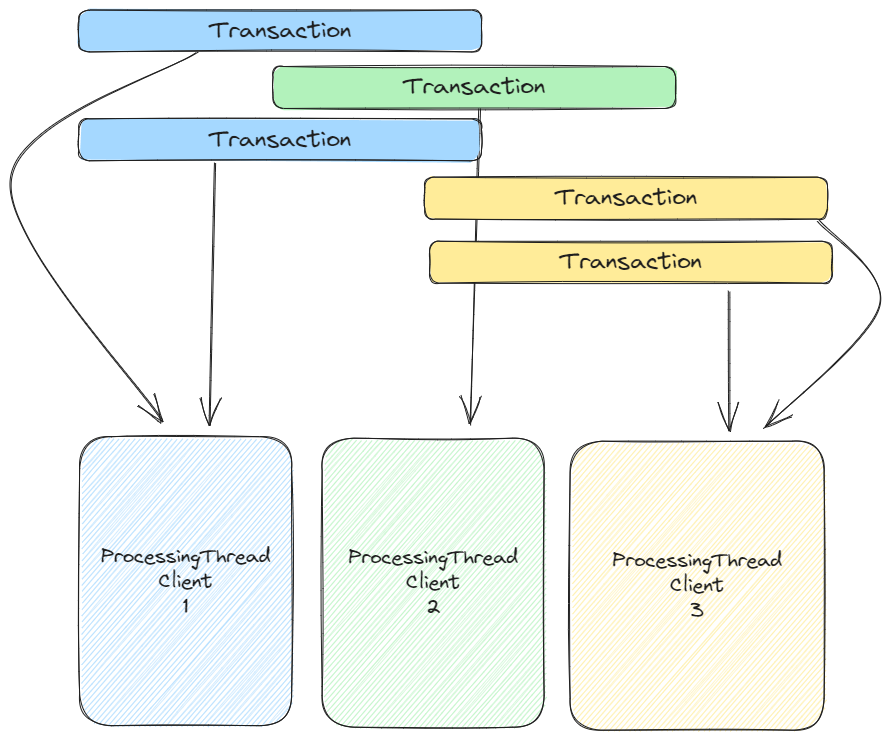

# Toy Payment Engine

A simple payment engine implementation in Rust that accepts an input transaction file (provided as an `.csv`) and outputs the final clients and their balance.  

## Assumptions:
- Only `Deposits` are disputable
- All TransactionIds are globally unique and not provided mulitple times (replays)
- A Deposit can only be disputed once. Any further operations are ignored
- A client has only one single asset account
- If a deposit references a non-existing client it will be created beforehand.
- Amount is less than `u64::MAX / 10000`
- Clients with a zero-balance are still required to be exported
- `dispute`, `resolve`, `chargeback` are passed as `xxxx, 2, 8,`

## Focus
**Don't Panic**  
As this simulates a financial (possibly high-performing) environment its important that all transactions are resulting in a predictable state and must not terminate an execution.

**Atomicity**  
If any part of the transaction fails, no state will be updated.

**Performance**  
Input files are processed as a stream so that the execution starts immediately.  
This allows for a (future) feature that could resume a previously processed file (e.g. if the process is killed).

## Remarks
While the input provides the amounts as a fixed point number the engine uses `u64` internally where the input is multiplied by `10000`.  
This is to ensure we will never have any issues with decimal places (even though this would not be the case here with only additions and subtractions).
Because of that, the amount is maxed at `u64::MAX / 10000`.

## An alternative, parallel solution
The processing procedure can be parallelized because the balance is stored on the client object.
So every transaction could be grouped by the client id into a separate queue that then can be processed in its own thread.
Of course, sometimes it doesn't make sense to have a thread per clientId (as its a costly operation) so a threadpool might also be an interesting solution

## Provided files
- `input.csv` an example CSV
- `output.csv` output generated for `input.csv`
- `large_input.zip` a zipped input csv with 10_000_000 rows